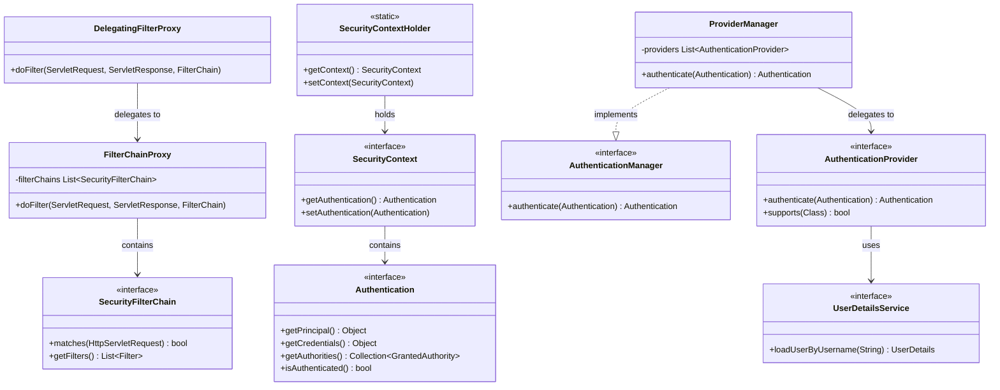

# Security domain model

## 버려야 할 편견

- Spring Security는 로그인할 때 사용하는 것이 아니다. 로그인은 별개의 애플리케이션 서비스이다.
- Layered, Hexagonal 아키텍처는 DDD 구성요소를 완전히 설명하지 못한다. 

## DDD 구성요소

## 요약 목록

* 도메인 모델링 구성요소: Entity, Value Object, Aggregate, Factory, Repository
* 도메인 로직 및 제어 구성요소: Domain Service, Application Service
* 컨텍스트 및 경계 구성요소: Bounded Context, Context Map

## Spring Security 구성요소 분석 

## DDD 관점에서의 분류

* Aggregate Root (애그리거트 루트)
    * `SecurityFilterChain`: 보안 필터 체인의 진입점이자 전체 필터 목록을 관리하는 경계 역할을 합니다.
    * `SecurityContextHolder`: 애플리케이션 내에서 보안 컨텍스트에 접근하는 최상위 전역 진입점입니다.
    * `AuthenticationManager` / `ProviderManager`: 인증 프로세스 전체를 총괄하고 조율하는 중심 객체입니다.

* Entity (엔티티)
    * `SecurityContext`: 고유한 인증 상태(`Authentication`)를 유지하고 관리하며, 스레드마다 독립적인 식별성을 가집니다.

* Value Object (값 객체)
    * `Authentication`: 사용자의 인증 정보, 권한 목록(`GrantedAuthority`), 인증 여부 등을 담고 있는 불변 성격의 데이터 객체입니다.
    * `GrantedAuthority`: 사용자가 가진 개별 권한을 나타내는 불변 객체입니다.
    * `UserDetails`: 사용자의 핵심 정보(아이디, 비밀번호, 상태 등)를 캡슐화한 데이터 객체입니다.

* Domain Service (도메인 서비스)
    * `AuthenticationProvider`: 실제 인증 로직(비밀번호 비교, 사용자 검증 등)을 수행하는 비즈니스 서비스입니다.
    * `UserDetailsService`: 저장소에서 사용자 정보를 조회하는 특정 도메인 비즈니스 로직을 처리하는 서비스입니다.

* Infrastructure / Factory (인프라스트럭처 / 팩토리)
    * `DelegatingFilterProxy`: 서블릿 컨테이너와 스프링 컨텍스트를 연결하는 인프라스트럭처 필터입니다.
    * `FilterChainProxy`: 스프링 시큐리티의 인프라적 필터 처리를 위임받아 수행하는 핵심 엔진입니다.

## 5-Step architecture 관점에서의 재 분류

- Aggregate Root
  - Authentication: 사용자 인증 정보를 관리하는 토큰 형태로 구현
- Service
  - AuthenticationProvider: 인증 로직을 구현
- Endpoint
  - Filter
- Infra
  - SecurityFilterChain