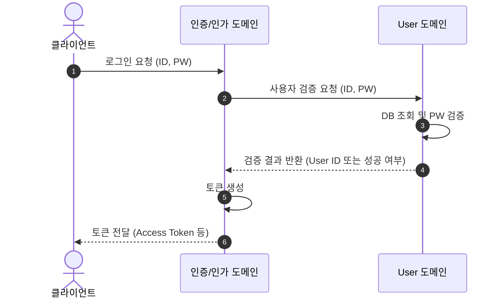

# Security domain model

## User domain과의 관계

```mermaid
sequenceDiagram
    autonumber
    actor Client as 클라이언트
    participant Auth as 인증/인가 도메인
    participant User as User 도메인

    Client->>Auth: 로그인 요청 (ID, PW)
    Auth->>User: 사용자 검증 요청 (ID, PW)
    User->>User: DB 조회 및 PW 검증
    User-->>Auth: 검증 결과 반환 (User ID 또는 성공 여부)
    Auth->>Auth: 토큰 생성
    Auth-->>Client: 토큰 전달 (Access Token 등)
```